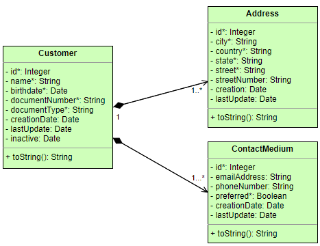

# Workshop SpringBoot 

### **1 Contexto**
- Caso de Uso 1 - MS Customer Management
 Microserviço para manter base de dados de clientes

### **2 Escopo**
Esse microsserviço permite manter uma base de dados de cadastro de clientes, com os seus contatos e endereços. E disponibiliza as operações para criar, atualizar, deletar, consultar clientes na base de dados. A documentação seguirá o padrão OpenAPI no template Swagger.

### **3 Componentes**

### **4 Modelo conceitual**
- #### Entidades

- #### Estrutura básica de pacotes 

- #### Modelo de diagrama de classes 

- #### Sequência das atividades 

##### 5.1.1 URL da operação
> /CustomerManagement
**Method:** GET

