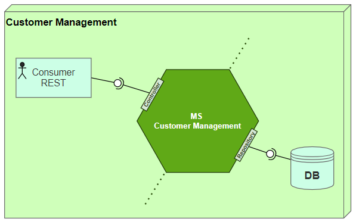

# Workshop SpringBoot 

### **1 Contexto**
- Caso de Uso 1 - MS Customer Management
 Microserviço para manter base de dados de clientes

### **2 Escopo**
Esse microsserviço permite manter uma base de dados de cadastro de clientes, com os seus contatos e endereços. E disponibiliza as operações para criar, atualizar, deletar, consultar clientes na base de dados. A documentação seguirá o padrão OpenAPI no template Swagger.

### **3 Componentes**



### **4 Modelo conceitual**
- #### Entidades


- #### Estrutura básica de pacotes 


- #### Modelo de diagrama de classes 


- #### Sequência das atividades 


##### 5.1.1 URL da operação
> /CustomerManagement
**Method:** GET

> /CustomerManagement
**Method:** POST

- Request
```json

{
  "address": [
    {
      "city": "Curitiba",
      "country": "BRA",      
      "state": "Paraná",
	  "neighborhood": "Batel",
      "street": "Bento Viana",
      "streetNumber": "1250"
    },
	{
      "city": "Curitiba",
      "country": "BRA",      
      "state": "Paraná",
	  "neighborhood": "Centro",
      "street": "Rua Visconde de Nácar",
      "streetNumber": "2161"
    }
  ],
  "birthdate": "1980-01-28",
  "contacts": [
    {
      "emailAddress": "josematos@gmail.com",
      "phoneNumber": "41991080058",
      "preferred": true
    },
	{
      "emailAddress": "jmatos@company.com",
      "phoneNumber": "4121219100",
      "preferred": false
    }
  ],
  "documentNumber": "66341413000148",
  "documentType": "PJ",  
  "name": "Jose Matos "
}

```

- Response
201 - Created

