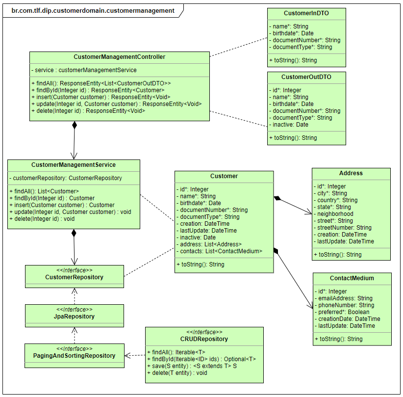

# Workshop SpringBoot 

### **1 Contexto**
- Caso de Uso 1 - MS Customer Management
 Microserviço para manter base de dados de clientes

### **2 Escopo**
Esse microsserviço permite manter uma base de dados de cadastro de clientes, com os seus contatos e endereços. E disponibiliza as operações para criar, atualizar, deletar, consultar clientes na base de dados. A documentação seguirá o padrão OpenAPI no template Swagger.

### **3 Componentes**


### **4 Modelo conceitual**
- #### Entidades


- #### Estrutura básica de pacotes 


- #### Modelo de diagrama de classes 


- #### Sequência das atividades 


#### 5.1.1 URL da operação
`Listar base de clientes`
> {Host:port}/customerdomain/v1/customerManagement 
- | **Method:** GET |  **Code Status:** 200 |
 
`Buscar um cliente por ID`
> {Host:port}/customerdomain/v1/customerManagement/{id}
- | **Method:** GET |  **Code Status:** 200 |

`Castrar novo cliente`
> {Host:port}/customerdomain/v1/customerManagement
- | **Method:** POST |  **Code Status:** 201 |
- **Body:** {Request}

` Atualizar cadastro do cliente`
> {Host:port}/customerdomain/v1/customerManagement/{id}
- | **Method:** PATCH |  **Code Status:** 204 |
- **Body:** {Request}

`Remover um cliente`
> {Host:port}/customerdomain/v1/customerManagement/{id}
- | **Method:** DELETE |  **Code Status:** 204 |


#### 5.1.2 Exemplo de Request / Resonse

- Request
```json

{
  "address": [
    {
      "city": "Curitiba",
      "country": "BRA",      
      "state": "Paraná",
	    "neighborhood": "Batel",
      "street": "Bento Viana",
      "streetNumber": "1250"
    },
	{
      "city": "Curitiba",
      "country": "BRA",      
      "state": "Paraná",
	    "neighborhood": "Centro",
      "street": "Rua Visconde de Nácar",
      "streetNumber": "2161"
    }
  ],
  "birthdate": "1980-01-28",
  "contacts": [
    {
      "emailAddress": "fulando@gmail.com",
      "phoneNumber": "41990020010",
      "preferred": true
    },
	{
      "emailAddress": "fulano@company.com",
      "phoneNumber": "4121219100",
      "preferred": false
    }
  ],
  "documentNumber": "66341413000148",
  "documentType": "PJ",  
  "name": "Fulano de Tal"
}

```

- Response

```json

[
  {
    "id": 1,
    "name": "Cicrano Silva",
    "birthdate": "1980-01-28",
    "documentNumber": "47587420738",
    "documentType": "CPF",
    "inactive": null,
    "address": [
      {
        "city": "São Paulo",
        "country": "BRA",
        "state": "São Paulo",
        "neighborhood": null,
        "street": "Avenida Matos",
        "streetNumber": "105"
      }
    ],
    "contacts": [
      {
        "emailAddress": "Cicrano@gmail.com",
        "phoneNumber": "11990010101",
        "preferred": true
      }
    ]
  }

```


### **6 Fluxos de erros**
Caso o corra um erro será retornado no http.status diferente de 200
A descrição do erro será informado do obejto de erro: segue estrutura

```json
{
  "timestamp": "2021-06-30T13:40:29.377+00:00",
  "status": 400,
  "error": "Client specified an invalid argument, request body o query param",
  "message": "BAD_REQUEST"
}
```

```json
{
  "timestamp": "2021-06-30T13:40:29.377+00:00",
  "status": 403,
  "error": "Authenticated user has no permission to access the requested resource",
  "message": "PERMISSION_DENIED"
}
```

```json
{
  "timestamp": "2021-06-30T13:40:29.377+00:00",
  "status": 404,
  "error": "A specified resource is not found",
  "message": "NOT_FOUND"
}
```

```json
{
  "timestamp": "2021-06-30T13:40:29.377+00:00",
  "status": 500,
  "error": "Server error",
  "message": "Internal Server Error"
}
```

```json
{
  "timestamp": "2021-06-30T13:40:29.377+00:00",
  "status": 504,
  "error": "Request timeout exceeded. Try it later",
  "message": "TIMEOUT"
}
```